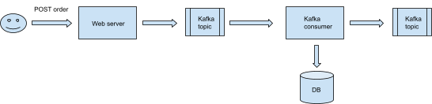

# Orders System

Application that simulates processing of store order from notification provider side. The system accepts HTTP requests,
these requests are passed to Kafka topic and after that a special Kafka consumer is responsible for storing the request
data in database and forward it to another topic.

****

## Installation and startup

Application should be started with [Docker](https://www.docker.com/). In order to start the application
with [Docker](https://www.docker.com/), please follow these steps:

1. Checkout the repository
2. Go in the **/docker/scripts** directory and execute the **up-all.sh** script
   


    sh up-all.sh


Executing the **up-all.sh** script will build and start all application modules as a docker containers. Containers will
be started in the docker default bridge network and will use the docker default volumes configured in the *
*docker-compose.yml**. Active profile for the Spring boot applications will be **docker** profile There is a special *
*.env** config fle from where these default configurations could be changed. On successful script execution, there will
be 6 running containers under the **orders-system** wrapper:

- **zookeeper**
    - Port (Host) - 2181
    - Port (Docker) - 2181
- **kafka**
    - Port (Host) - 9094
    - Port (Docker) - 9094
- **kafka-ui**
    - Port (Host) - 8055
    - Port (Docker) - 8080
- **orders-system-db**
    - Port (Host) - 5437
    - Port (Docker) - 5432
- **orders-api**
    - Port (Host) - 8080
    - Port (Docker) - 8080
- **orders-consumer**
    - Port (Host) - 8081
    - Port (Docker) - 8081

#### Applications access (default configuration):
- orders-api 
   - (Base) http://localhost:8080/orders-api
   - (Swagger) http://localhost:8080/orders-api/swagger-ui/

- orders-consumer 
  - (Base) http://localhost:8081/orders-consumer

- orders-system-db
  - jdbc:postgresql://localhost:5437/orders_system
  - user: postgres
  - password: postgres

- kafka-ui
  - (Base) http://localhost:8055

****

## Scripts

There are several scripts available in the  **/docker/scripts** directory:

- **up-all.sh** - Starts all containers
- **down-all.sh** - Stops all containers
- **up-servers.sh** - Starts only server containers (zookeeper, kafka, kafka-ui, orders-system-db). Useful on new
  features development in the custom applications.
- **remove-images.sh** - Remove custom application images. Useful when we have new functionality which is not part of
  our pre-build image and we want to remove the old one in order to replace it with the updated version.
- **remove-volumes.sh** - Remove all docker volumes that are configured in the **docker-compose.yml**. Useful when we
  want to start the applications with empty data.

****

## Applications

### orders-api

[Spring Boot](http://projects.spring.io/spring-boot/) application which works as a REST API and provides services for
order registration.

- Context path: - **/orders-api**
- Port: 8080

- Profiles:
    - local (applcation-local.yml)
    - docker (applcation-docker.yml)


- Endpoints:

 Method	 | Path	                 | Description	                      
---------|-----------------------|-----------------------------------|
 POST	   | /v1/{storeId}/orders	 | Register new order in the system	 

- Swagger - Swagger is available on ../swagger-ui/ path

  Example:  http://localhost:8080/orders-api/swagger-ui/

Example request data:

```json
{
  "id": 1,
  "createdDate": "27.08.2023 12:20:55",
  "shopperEmail": "denislavveizov@icloud.com",
  "shopperFirstName": "Denislav",
  "shopperLastName": "Veizov",
  "products": [
    {
      "id": 1,
      "name": "HEMNES",
      "description": "8-drawer dresser, white stain, 160x96 cm (63x37 3/4)",
      "price": 529.00,
      "quantity": 1
    },
    {
      "id": 2,
      "name": "FRIHETEN",
      "description": "Corner sofa-bed with storage, Skiftebo dark gray",
      "price": 1299.00,
      "quantity": 1
    },
    {
      "id": 3,
      "name": "RANARP",
      "description": "Work lamp, off-white",
      "price": 39.99,
      "quantity": 1
    }
  ]
}
```

- Kafka topics (write):

 Name	             | Key	             | Partitions	  
-------------------|------------------|--------------|
 orders.published	 | store-{storeId}	 | 3 (default)	 

****

### orders-consumer

[Spring Boot](http://projects.spring.io/spring-boot/) application which works as a [Kafka](https://kafka.apache.org/)
consumer and producer. The main responsibility of this module is to consume the orders, published by orders-api, save
them to the database and forward them to another [Kafka](https://kafka.apache.org/) topic.

- Context path: - **/orders-consumer**
- Port: 8081

- Profiles:
    - local (applcation-local.yml)
    - docker (applcation-docker.yml)


- Kafka topics (read):

 Name	             | Key	             | Partitions	  
-------------------|------------------|--------------|
 orders.published	 | store-{storeId}	 | 3 (default)	 

- Kafka topics (write):

 Name	           | Key	             | Partitions	  
-----------------|------------------|--------------|
 orders.created	 | store-{storeId}	 | 3 (default)	 
